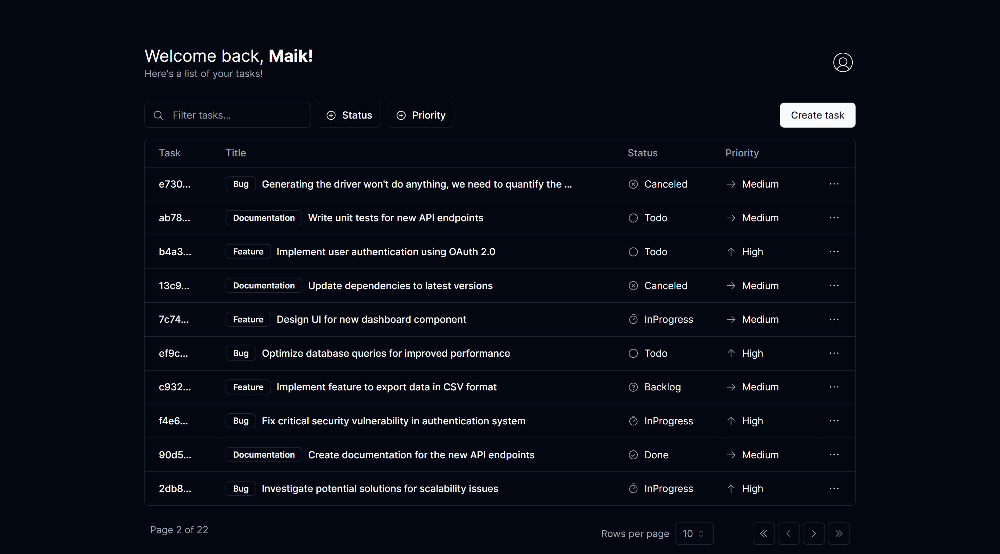

<h1 align="center"> Task Manager </h1>

[Click here to access](https://task-manager-maik.vercel.app/)

Case you want to see in pt-br, click in the link below:

## 🚀 Technologies

This project was developed with the following technologies:

- [React](https://react.dev/)
- [next.js](https://nextjs.org/)
- [typescript](https://www.typescriptlang.org/)
- [tailwind CSS](https://tailwindcss.com/)
- [shadcn/ui](https://ui.shadcn.com/)
- [next-auth](https://next-auth.js.org/)
- [next-themes](https://github.com/pacocoursey/next-themes)
- [prisma](https://www.prisma.io/)
- [supabase](https://supabase.com/)
- [phosphor-icons](https://phosphoricons.com/)
- [react-hook-form](https://react-hook-form.com/)
- [sonner](https://sonner.emilkowal.ski/)
- Git and GitHub

## 💻 Project

Task Manager is a versatile tool designed for efficient project management and task tracking. From planning to execution, users can easily create and manage development tasks.  
This project stemmed from my desire to learn and grow as a developer. As a study project, Task Manager served as a platform for me to experiment with various technologies and methodologies. Integrating authentication was one such endeavor, allowing me to exercise my knowledge and enhance the project's functionality. 

## 🔧 Functionalities

- Responsive layout;
- Authentication and authorization;
- Ability to create, edit and delete tasks;
- Three available theme options: Dark, light and system preference;
- Pagination;
- Filtering tasks by: search, priority or status;
- Effects hover and animation;
- All tasks are stored and linked with their users id;

And much more possibilities. Get in to find them.

See the preview video below:

https://github.com/maik-emanoel/task-manager/assets/105499887/6ab66e2e-427c-44ea-868e-33b2f0921873

## 🔖 Layout

During the development process, I drew inspiration from various sources to create a visually appealing and user-friendly interface. The login/signup interface closely resembles the example provided by [Shadcn/ui](https://ui.shadcn.com/), while the home page layout adapts elements from the Tasks interface of the same source. By leveraging these inspirations, I aimed to create a cohesive and intuitive design for Task Manager while adding my unique touches and customizations.

## Feedback

If you have some feedback, please let me know by contato.maikemanoel@gmail.com
