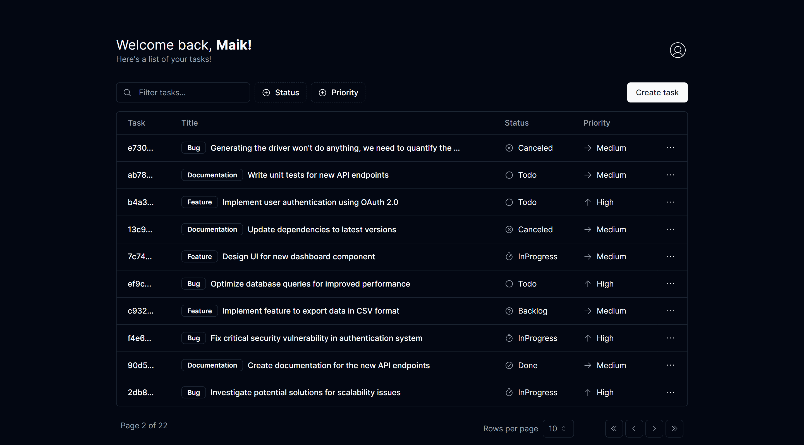

<h1 align="center"> Task Manager </h1>

[Clique aqui para acessar](https://task-manager-maik.vercel.app/)

Caso você queira ver em en-US, clique no link abaixo:

## 🚀 Tecnologias

Este projeto foi desenvolvido com as seguintes tecnologias:

- [React](https://react.dev/)
- [next.js](https://nextjs.org/)
- [typescript](https://www.typescriptlang.org/)
- [tailwind CSS](https://tailwindcss.com/)
- [shadcn/ui](https://ui.shadcn.com/)
- [next-auth](https://next-auth.js.org/)
- [next-themes](https://github.com/pacocoursey/next-themes)
- [prisma](https://www.prisma.io/)
- [supabase](https://supabase.com/)
- [phosphor-icons](https://phosphoricons.com/)
- [react-hook-form](https://react-hook-form.com/)
- [sonner](https://sonner.emilkowal.ski/)
- Git and GitHub

## 💻 Projeto

O Task Manager é uma ferramenta versátil projetada para gerenciamento eficiente de projetos e rastreamento de tarefas. Do planejamento à execução, os usuários podem criar e gerenciar facilmente tarefas de desenvolvimento.  
Este projeto surgiu como um projeto de estudo, o Task Manager serviu de plataforma para eu experimentar diversas tecnologias e metodologias. A integração da autenticação foi uma dessas empreitadas, permitindo-me exercitar meus conhecimentos e aprimorar a funcionalidade do projeto. 

## 🔧 Funcionalidades

- Layout responsivo;
- Autenticação e autorização;
- Capacidade de criar, editar e excluir tarefas;
- Três opções de temas disponíveis: Escuro, claro e preferência de sistema;
- Paginação;
- Filtrar tarefas por: busca, prioridade ou status;
- Efeitos hover e animação;
- Todas as tarefas são armazenadas e vinculadas ao seu id de usuário;

E muito mais possibilidades. Entre para encontrá-los.

Veja o vídeo de demonstração abaixo:

https://github.com/maik-emanoel/task-manager/assets/105499887/6ab66e2e-427c-44ea-868e-33b2f0921873

## 🔖 Layout

Durante o processo de desenvolvimento, inspirei-me em diversas fontes para criar uma interface visualmente atraente e fácil de usar. A interface de login/inscrição se assemelha muito ao exemplo fornecido no [Shadcn/ui](https://ui.shadcn.com/), enquanto o layout da página inicial adapta elementos da interface de Tasks da mesma fonte. Aproveitando essas inspirações, pretendi criar um design coeso e intuitivo para o Task manager, ao mesmo tempo em que adicionei toques e personalizações exclusivos.

## Feedback

Se você tiver algum feedback, por favor me avise por contato.maikemanoel@gmail.com
